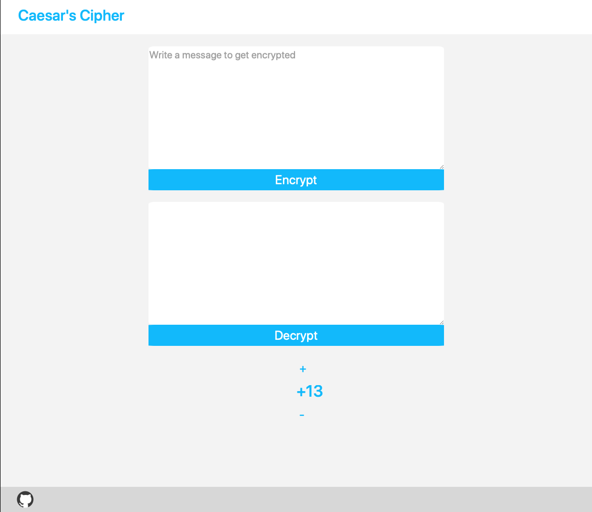

# Online-encoder-decoder

This Project uses Caesar's cipher in order to cipher and decipher text. 
The functioniality was written in JavaScript.
The user can select the encoder code for the Caesar Cipher

